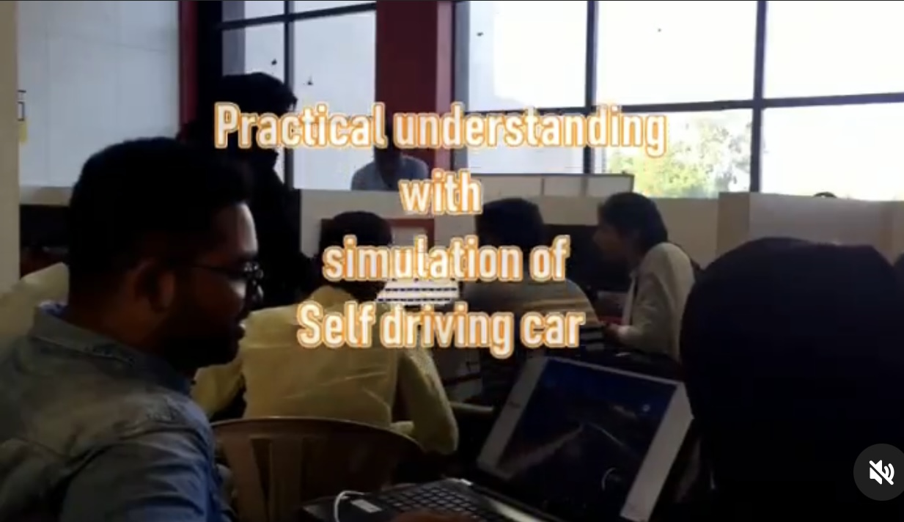

# Full-Stack Development Program

Welcome to the comprehensive 32-day full-stack training program! Below, you'll find all the resources organized by session.

---

## 📄 Proposal
- [Training Proposal Document](Proposal.md)
- [Trainer CV](proposal/CV.pdf)

---

## 📊 Presentations

| Day  | Topic                                | Link to Presentation                     |
|------|--------------------------------------|------------------------------------------|
| 1    | HTML & CSS Basics                   | [HTML_CSS.pptx](Presentations/Day_01_HTML_CSS.pptx) |
| 2    | JavaScript Fundamentals             | [JS_Fundamentals.pptx](Presentations/Day_02_JS_Fundamentals.pptx) |
| 3    | Advanced JavaScript & DOM           | [Advanced_JS.pptx](Presentations/Day_03_Advanced_JS.pptx) |
| 4    | Git & Version Control               | [Git.pptx](Presentations/Day_04_Git.pptx) |
| 5    | Building with Tailwind CSS          | [Tailwind.pptx](Presentations/Day_05_Tailwind.pptx) |
| 6    | Introduction to React               | [React.pptx](Presentations/Day_06_React.pptx) |
| 7    | React State and Props               | [React_Props_States.pptx](Presentations/Day_07_React_Props_States.pptx) |
| 8    | React Hooks: useEffect              | [React_UseEffect.pptx](Presentations/Day_08_React_UseEffect.pptx) |
| 9    | React Routing                       | [React_Routing.pptx](Presentations/Day_09_React_Routing.pptx) |
| 10   | Node.js Basics                      | [NodeJS.pptx](Presentations/Day_10_NodeJS.pptx) |
| 11   | Express.js and API Development      | [ExpressJS.pptx](Presentations/Day_11_ExpressJS.pptx) |
| 12   | MongoDB Basics and CRUD Operations  | [MongoDB.pptx](Presentations/Day_12_MongoDB.pptx) |
| 13   | Authentication with JWT             | [JWT_Authentication.pptx](Presentations/Day_13_JWT_Authentication.pptx) |
| 14   | Middleware in Node.js               | [Middleware.pptx](Presentations/Day_14_Middleware.pptx) |
| 15   | State Management with Redux         | [Redux.pptx](Presentations/Day_15_Redux.pptx) |
| 16   | React Optimization Techniques       | [React_Optimization.pptx](Presentations/Day_16_React_Optimization.pptx) |
| 17   | Deployment of MERN Applications     | [Deployment.pptx](Presentations/Day_17_Deployment.pptx) |
| 18   | Capstone Project Kick-off           | [Capstone_Kickoff.pptx](Presentations/Day_18_Capstone_Kickoff.pptx) |
| 19   | Project Kickoff: E-commerce App    | [Day 19 Project Kickoff](Presentations/Day_19_Ecommerce_Kickoff.pptx) |
| 20   | Setting Up the Frontend            | [Day 20 Frontend Setup](Presentations/Day_20_Frontend_Setup.pptx) |
| 21   | Product Listing Page               | [Day 21 Product Listing](Presentations/Day_21_Product_Listing.pptx) |
| 22   | Product Details and Search         | [Day 22 Product Details](Presentations/Day_22_Product_Details.pptx) |
| 23   | Authentication and User Accounts   | [Day 23 Authentication](Presentations/Day_23_Authentication.pptx) |
| 24   | Cart and Checkout                  | [Day 24 Cart_Checkout](Presentations/Day_24_Cart_Checkout.pptx) |
| 25   | Admin Dashboard                    | [Day 25 Admin_Dashboard](Presentations/Day_25_Admin_Dashboard.pptx) |
| 26   | Course Creation Flow               | [Day 26 Course_Creation](Presentations/Day_26_Course_Creation.pptx) |
| 27   | Reviews and Ratings                | [Day 27 Reviews_Ratings](Presentations/Day_27_Reviews_Ratings.pptx) |
| 28   | Payment Gateway Integration        | [Day 28 Payments](Presentations/Day_28_Payments.pptx) |
| 29   | Frontend Optimization              | [Day 29 Optimization](Presentations/Day_29_Optimization.pptx) |
| 30   | Deployment: Frontend and Backend   | [Day 30 Deployment](Presentations/Day_30_Deployment.pptx) |
| 31   | Debugging and Final Touches        | [Day 31 Debugging](Presentations/Day_31_Debugging.pptx) |
| 32   | Final Presentation and Demo        | [Day 32 Final_Demo](Presentations/Day_32_Final_Demo.pptx) |
---

## 🧑‍💻 Starter Code

| Day  | Topic                                | Boilerplate Link                         |
|------|--------------------------------------|------------------------------------------|
| 1    | HTML & CSS Basics                   | [Day 1 Boilerplate](Starter_Code/Day_01_Boilerplate) |
| 2    | JavaScript Fundamentals             | [Day 2 Starter Code](Starter_Code/Day_02_JS_Starter) |
| 3    | Advanced JavaScript & DOM           | [Day 3 Starter Code](Starter_Code/Day_03_Advanced_JS) |
| 4    | Git & Version Control               | [Day 4 Starter Code](Starter_Code/Day_04_Git) |
| 5    | Tailwind CSS                        | [Day 5 Boilerplate](Starter_Code/Day_05_Tailwind) |
| 6    | React Basics                        | [Day 6 Starter Code](Starter_Code/Day_06_React) |
| 7    | React State and Props               | [Day 7 Boilerplate](Starter_Code/Day_07_React_Props) |
| 8    | React Hooks: useEffect              | [Day 8 Starter Code](Starter_Code/Day_08_React_UseEffect) |
| 9    | React Routing                       | [Day 9 Boilerplate](Starter_Code/Day_09_React_Routing) |
| 10   | Node.js Basics                      | [Day 10 Starter Code](Starter_Code/Day_10_NodeJS) |
| 11   | Express.js and API Development      | [Day 11 Boilerplate](Starter_Code/Day_11_ExpressJS) |
| 12   | MongoDB Basics and CRUD Operations  | [Day 12 Starter Code](Starter_Code/Day_12_MongoDB) |
| 13   | Authentication with JWT             | [Day 13 Boilerplate](Starter_Code/Day_13_JWT) |
| 14   | Middleware in Node.js               | [Day 14 Starter Code](Starter_Code/Day_14_Middleware) |
| 15   | State Management with Redux         | [Day 15 Boilerplate](Starter_Code/Day_15_Redux) |
| 16   | React Optimization Techniques       | [Day 16 Starter Code](Starter_Code/Day_16_React_Optimization) |
| 17   | Deployment of MERN Applications     | [Day 17 Boilerplate](Starter_Code/Day_17_Deployment) |
| 18   | Capstone Project Kick-off           | [Day 18 Starter Code](Starter_Code/Day_18_Capstone_Kickoff) |
| 19   | Project Planning and Setup          | [Day 19 Boilerplate](Starter_Code/Day_19_Project_Setup) |
| 20   | Frontend API Integration            | [Day 20 Starter Code](Starter_Code/Day_20_Frontend_API) |
| 21   | Backend API Refinement              | [Day 21 Boilerplate](Starter_Code/Day_21_Backend_Refinement) |
| 22   | React Component Optimization        | [Day 22 Starter Code](Starter_Code/Day_22_React_Optimization) |
| 23   | Authentication Integration          | [Day 23 Boilerplate](Starter_Code/Day_23_Auth_Integration) |
| 24   | Advanced Database Queries           | [Day 24 Starter Code](Starter_Code/Day_24_Advanced_DB) |
| 25   | UI/UX Refinements                   | [Day 25 Boilerplate](Starter_Code/Day_25_UI_UX) |
| 26   | Advanced Routing and Navigation     | [Day 26 Starter Code](Starter_Code/Day_26_Advanced_Routing) |
| 27   | Performance Testing and Debugging   | [Day 27 Boilerplate](Starter_Code/Day_27_Performance_Testing) |
| 28   | Deployment Review and Testing       | [Day 28 Starter Code](Starter_Code/Day_28_Deployment_Review) |
| 29   | Final Project Integration           | [Day 29 Boilerplate](Starter_Code/Day_29_Project_Integration) |
| 30   | Project Testing and Feedback        | [Day 30 Starter Code](Starter_Code/Day_30_Testing_Feedback) |
| 31   | Project Presentation Prep           | [Day 31 Boilerplate](Starter_Code/Day_31_Presentation_Prep) |
| 32   | Capstone Completion                 | [Capstone Code](Starter_Code/Capstone_Final) |

---

## 📷 Training Gallery
Below are some highlights from past sessions:

 

 
 
 

---

## 🚀 Capstone Project
The final capstone project will involve creating a fully functional web application using the MERN stack. Starter code for frontend and backend is provided:
- [Frontend Boilerplate](Capstone_Project/Frontend/React_Boilerplate/)
- [Backend Boilerplate](Capstone_Project/Backend/Express_Boilerplate/)

---

## 🤝 Contact
If you have any questions or need additional details, feel free to contact me:
- **Email:** [your-email@example.com](mailto:your-email@example.com)
- **Phone:** [Your Phone Number]
